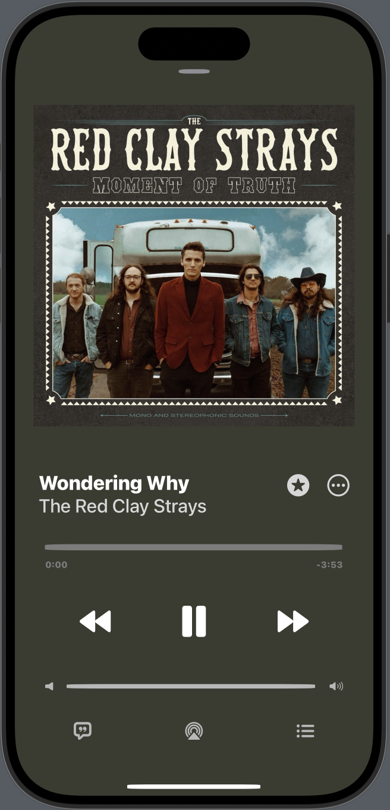

# f24-bootcamp-musicplayer

1. Recreation of Apple Music user interface

2. Replicates the button and image arrangements of the apple music interface
3. Used ZStack, HStack, VStack, Padding
4. Hope to implement user functionality to the buttons and sliders in future
